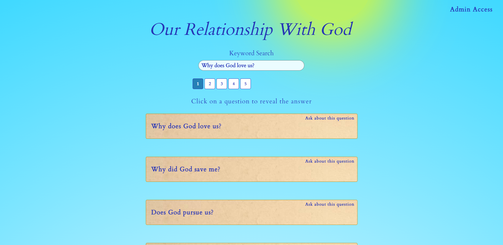
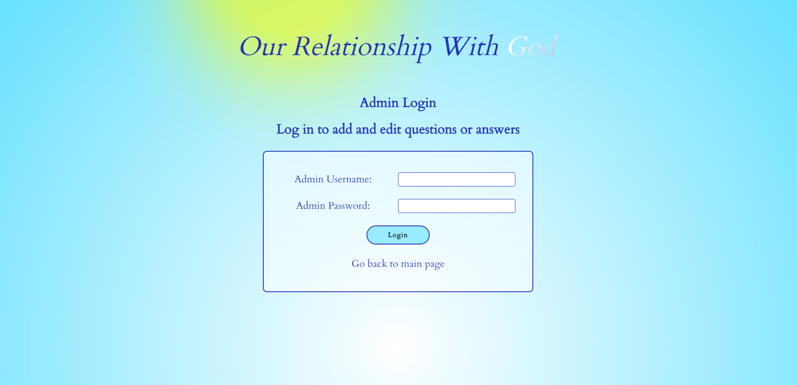
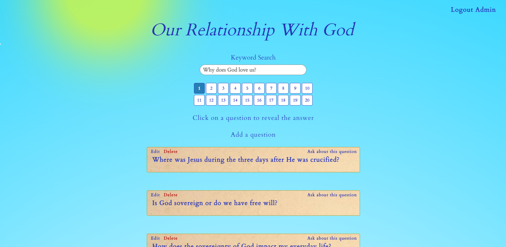
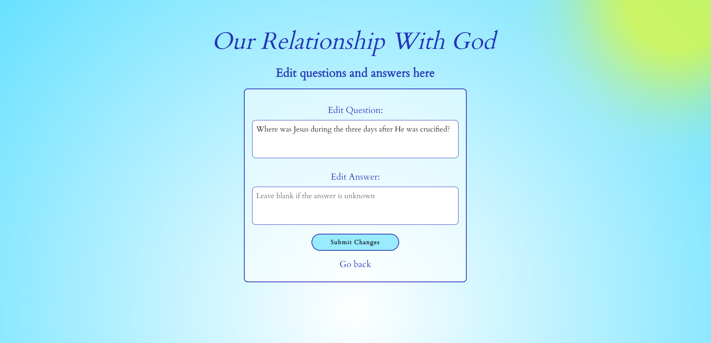
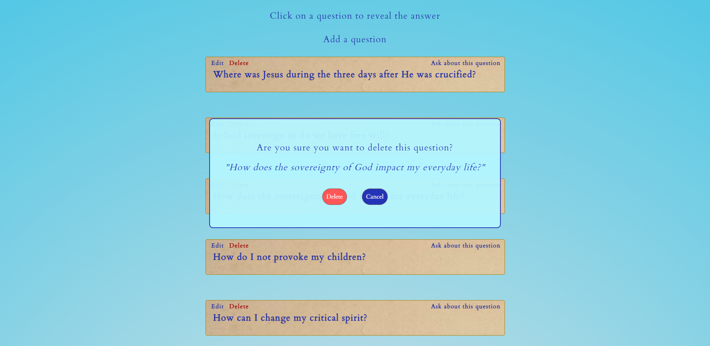

# ORWG-Webpage
A webpage that allows users to view questions, while an admin can create/edit/delete questions and answers.

## Deployed Link
__https://orwg-webapp.herokuapp.com/__

## Description
The ORWG (Our Relationship with God) web application is a project that was inspired by a local ministry's need to display questions and answers for their group. Instead of keeping something like an Excel or Word file to display these questions, I was asked to build an application that would be more appealing to the user. The most important function, however, is to give an individual access to create, update, or delete a question when necessary.

This is a full-stack application that uses MongoDB for data storage, Express and Node.js for running the server, and a template engine (EJS) for rendering views based on user authentification. An admin is allowed to login and create a session upon successful entry. Once authorized, the admin can make changes as needed and simply logout once the work is done!

Admin access serves a huge purpose, as a customer can update their own data without the need of my services. 

:exclamation:__Disclaimer: This application DOES NOT reflect my personal beliefs. The questions were provided to me and are not a representation of my religion or ideals.__:exclamation:

## User Story

_As a Ministry Leader_

_I would like to display to my followers questions and answers related to the Church_

_While being able to update the existing list_

## Tech Stack
- HTML/CSS/Javascript
- Sass
- Node.js
- Express.js
- EJS
- MongoDB
- Mongoose.js

## Goals of Deployment
- [x] Questions will be displayed to a user who visits the landing page
- [x] A user can either search for a question, or browse through pages for a question
- [x] A user can sign in as an admin
- [x] Admins will be taken to the question page, where the option to add, edit, and delete questions are displayed per question
- [x] An admin can successfully add a new question, edit an existing question, or delete a question of choice
- [x] The admin can log out of their session and be returned to the normal view without admin abilities

## Screenshots

